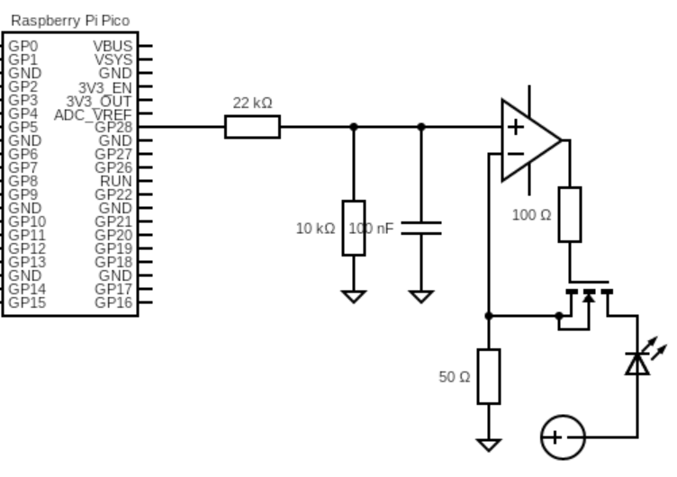

# Engineering Design Document
## Fluorescence-Based Spectrometer for Biophotonic Signal Acquisition
Author: Scott Torzewski

## Rationale
Studying analog/mixed-signal (AMS) design is crucial for biotechnology applications because it enbales the precise and efficient processing of delicate biological signals. These signals are often extremely weak and operate within noisy physiological environments, which presents a challenge for detection and analysis. Optical analog front-end circuits are the first point of contact for the raw, continous data from our physical world and play a critical role in determining the system sensitivity and accuracy before the signal is converted to the digital domain. 

At a higher-level, exploring AMS design is essential for bioprocessing systems because it enables the development of high-performance sensors needed for real-time monitoring and control. As an engineer in the biopharmaceuitcal manufacturing industry, I am constanty exposed to Process Analytical Technology (PAT) such as the RamanRxN4, a high-performance Raman spectroscopy system that includes a specialized bIO-PRO probe for sterile integration with bioreactors.  As biprocessing shifts towards this data-driven paradigm, AMS technology provides the electronics that can accurately acquire sensor signals within challenging bioreactor enviornments. 

## Terminology

### Biology
Analyte: A substance or chemical component in a sample that is the subject of a chemical analysis. It is the specific thing you are looking for and measuring in an experiment.

Fluorescence: The process where a substance absorbs light of one color and then immediately gives off light of a different color which has a longer wavelength. For example, a molecule might absorb blue light but emit green light.

Molecular Extinction Coefficient: The measure of how stongly a substance absorbs light at a particular wavelength which determines the brightness of the fluorophore.

Quantum Yield: The efficiency of the fluorescence process defined as the ratio of the number of photons emitted to the number of photons absorbed.

Stokes shift: The difference in wavelength between the light a substance absorbs and the fluorescent light it emits. A larger Stokes shift makes it easier for a detector to distinguish the emitted fluorescent light from the exciting light.

### Electrical
Bandwidth: The range of frequencies over which a sensor can accurately measure and respond to a changing input. A sensor with a high bandwidth can accurately capture rapid changes in a signal. We can establish this bandwidth with capacitors that allow a specific range of signals to pass through the resistor before acting as a short to ground.

Common-Mode: The signal that is present and identical at both input terminals of a circuit. It is often unwanted noise or interference from external sources. Differential amplifiers are the primary tool for dealing with common-mode noise. This is quantified by its common-mode rejection ratio (CMRR), where a high value indicates an amplifier performs very well in amplifying the intended signal and suppressing the common-mode noise.

Closed-Loop Gain: The gain of an amplifying device after a negative feedback loop has been applied. This configuration regulates the enormous open-loop gain for a stable, controllable signal.

Dark Current: The current generated by the photodiode in the absence of light due to the random thermal generation of electron-hole pairs within the semiconductor's depletion region.

Differential Amplifier: Any amplifier that amplifies the voltage difference between two signals. 

Electric Field: A vector field that assumes the space around electrically charged particles and time-varying magnetic fields. It is defined as the force per unit positive charge (q) that a charged particle would experience at any given point in space. The field points away from positive charges and towards negative charges.

Fluorometer: A fluorescence spectrometer instrument that measures the fluorescent light properties of a sample.

Incident Light: The light that strikes an object or medium.

Junction Capacitance: The parasitic junction capacitance is the unwanted capacitance that occurs at the p-n junction of a photodiode and other semiconductor devices. At high frequencies, it can slow down the sensor's response time.

Linearity: How consistently a sensor's output changes in proportion to the input. A perfectly linear sensor would produce a perfectly straight-line graph when you plot its output versus the physical quantity it's measuring. With good linearity, you can use a few points as opposed to a complex curve-fitting formula to convert its output into a real-world value and more easily verify its accuracy.

MOSFET: A metal oxide semiconductor field effect transistor. It controls the flow of current between two terminals (drain and source) through an external voltage applied to a third terminal (gate). They can act as amplifiers or switches and are the foundation of all modern electronic equipment. 

Noise: Unwanted, outside interference in the sensor's output signal. Noise can be a signal from the sensor's own electronics, external electrical interference, or heat. It obscures the real signal. In electronics engineering, we aim for a high signal-to-noise ratio (SNR). A strong signal with little noise means our observation only includes what was intended to be measured.

Open-Loop Gain: The intrinsic gain of an amplifying device without any external feedback. It is exceptionally high and uncontrolled, which makes it impractical for most precision applications.

Operational Amplifier: A highly specialized differential amplifier with a very high open-loop gain designed to be used with external components to precisely control its characteristics. By connecting a feedback loop from the output to the inverting input, the op-amp's massive gain is regulated, and its behavior is dictated almost entirely by these external components.

Sensitivity: How much a sensor's output changes for a given change in the quantity it's measuring. A high-sensitivity sensor produces a large change in output for a small change in input. Higher sensitivity is usually desired so that the delta is maximized for observation into the effects of the target of the sensor.

Stability: A sensor's ability to provide consistent and accurate readings over a long period. A sensor is stable if its characteristics do not change with time. If a sensor lacks stability, its performance will degrade over time. This is known as drift. Drift can occur due to several reasons, including the aging of the physical properties of a sensor's component, environmental stress, and contamination.

Transimedpance Amplifier: An electronic circuit that converts a small input current into a usable output voltage. It consists of an op-amp and a feedback resistor, where the output voltage is equal to the product of the inverted input current and the feedback resistance.

## Background

### Semiconductors

Semiconductor devices rely on what is known as the P–N junction. We start with a semiconductor such as silicon, whose crystalline lattice has four valence electrons. This allows it to behave as either a conductor or insulator depending on conditions. One region of the silicon is doped with a pentavalent impurity (such as phosphorus, which has five valence electrons). This produces an N-type region with an excess of free electrons as majority carriers. The other region is doped with a trivalent impurity (such as boron, with three valence electrons), creating a P-type region with electron “holes” (vacancies in the lattice that act as positive charge carriers) as the majority carriers.

When the P-type and N-type materials are joined, a diffusion process occurs: electrons from the N-region migrate into the P-region to fill holes, and holes from the P-region migrate into the N-region. This transfer leaves behind immobile ionized donor atoms (positively charged in the N-region) and ionized acceptor atoms (negatively charged in the P-region). These fixed charges create an electric field across the junction. As diffusion continues, this field builds until it counteracts further carrier motion, and the system reaches equilibrium. The region around the interface becomes the depletion layer. It is nearly free of mobile charge carriers. The N-side is left with a net positive charge due to uncovered donor ions, while the P-side is left with a net negative charge due to uncovered acceptor ions. This results in a built-in electric field directed from the positive N-side toward the negative P-side that produces a built-in potential barrier (the contact potential).

To drive current across the junction, an external voltage must be applied that either reinforces or opposes this barrier (forward bias vs. reverse bias). With a forward bias, an external voltage opposes the built-in potential and shrinks the depletion region. With a reverse bias, an external voltage reinforces the built-in potential and widens the depletion region. In a photodiode, when incident photons with energy greater than the silicon bandgap strike the depletion region, they excite electrons from the valence band into the conduction band and generate electron–hole pairs. The built-in electric field immediately sweeps electrons toward the N-side and holes toward the P-side which produces a measurable photocurrent. We choose to widen the depletion region by applying a reverse-bias to phototiodes because it reduces the inherit parastic capacitance created by the p-n junction, increases the number of electrons collected per incident photon, and reduces the time for charge carriers to cross the junction. This process, the conversion of absorbed light into electrical energy, is known as the photovoltaic effect. It forms the basis for all optical systems.

### Fluorescence Sensing

Fluorophores are photoreactive chemical compounds that absorb light energy of a certain wavelength and emit that light at a longer wavelength. This occurs due to the movements of electrons from a ground state to an excited state, and back to a ground state. The action of falling back to a ground state emits photons that can be measured. The emission light spectrum has a slightly longer wavelength than the absorption specturm due to the phenomenon of Stokes shift. In sensing applications the fluorophore's emission changes in a predictable way when it interacts with a target substance.

The funamental process of fluorescence sensing involves three steps.

  1) Excitation: A light source shines on a sample, which excites the electrons in the fluorophore to a higher energy state.
  2) Interaction: When a speciic target analyte is present, it binds to or otherwise interacts with the fluorophore, which       alters the fluorophore's emission properties.
  3) Emission and detection: The excited electrons return to their ground state and emitt photons that are detected and          measured by a sensor. The fluorescence signal is inherently weaker than the excitation light using to produce it.          Therefore, by positioning the detector at a 90-degree angle, you ensure the detector does not collect light from the       more powerful source. The 90-degree geometry also reduces the amount of scattered light excitation than can reach          the detector to allow for a clearer measurement of the emitted fluoresence. 

 

 

 

Fluorescence sensing is a useful tool for biomarker detection due to its high sensitivity and selectivty, which enables the measurement of very low analyte concentrations. For example, in the context of Alzheimer's detection, enhanced fluorescence platforms are used to detect trace levels of biomarkers like amyloid-β and tau proteins in blood samples. 

There are several reasons for why it is important to explore fluorescence sensing technologies.

  1) Early disease diagnosis: Fluorescence sensing can detect minute changes in biomarker levels longer before symptoms          appear. For Alzheimer's disease, detecting alterations in amyloid-β and tau years in advance allows for earlier             intervention.
  2) Less invasive testing: For diseases like Alzheimer's spinal fluid analysis is often used despite its highly-invasive        nature. Fluorescence-based assays allow for the sensitive detection of biomarkers using more accessible blood samples.
  3) Real-time monitoring and imaging: Fluorescent probes can be used for real-time, high-resolution imaging in living           cells and tissues. This is crucial for exploring disease progression in cellular processes and the efficacy of drug         therapies.

Aside from the fluorophore itself, there are five main components required for a fluorometer. 

  1) Light excitation source: This is the light source that emits light at a specific wavelength to excite the fluorochrome.
  2) Optical filters: Spectrometers require two filters. An excitation filter selects the specific wavelength from               the light source that will excite the sample, while an emission filter blocks the excitation light while allowing the       longer-wavelength fluorescence to pass through the detector.
  3) Photodetector: This component measures the lighted emitted by the fluorescent sample and converts the photons into an       electrical signal, generating a "photocurrent."
  4) Analog front-end (AFE): The AFE processes the raw electrical signal from the photodetector for digitization. The goal       is to convert the current to a stable voltage signal that an analog-to-digital converter (ADC) can read for                 quantization.
  5) Microcontroller Unit (MCU): The MCU is the digital brain of the system. It is responsible for processing the digitzied      signal and outputting the final result as data that we can interpret.

## Proposed Design

### Fluorophore
To determine a fluorophore to use, I considered a readily available solvent with a relatively high molecular extinction coefficient and  quantum yield. Fluoroscein is a readily available, cheap fluorochrome that is solvent in water. Its excitation wavelength is 437 nm, while its emission wavelength is 515 nm. Its extinction coefficient is approximately 70,000 to 75,000 M⁻¹cm⁻¹, and the quantum yield is 0.92. Therefore, I selected fluorescein because of its high brightness and ease of access. The fluorescein will be mixed with water in a 10mm cuvette and placed in a 3D-printed enclosure which will hold the detector. 

### Light Excitation Source
The SST-10-SB-B130-M470 by Luminus Devices was chosen because it is a blue 470 nm LED with a peak emission (470 nm) that closely matches fluorescein’s excitation range (around 437 nm). Because I am using cheaper components, I am overshooting the typical excitation wavelength in case the light intensity isn't high as specified. This ensures efficient absorption and a strong fluorescence output. Addiionally, its compact SMD form factor makes it easy to integrate onto a PCB for a portable biosensor platform.

 

 

### Optical Filters
For the emission filter, I chose a 530 40 nm Narrow Bandpass Filter because its center wavelength (530 nm) is close enough to fluorescein’s emission peak (≈515 nm) to transmit a strong emission signal, while the 40 nm FWHM allows a reasonably narrow band (510-550 nm) that still blocks much of the excitation light and stray ambient light. Although its blocking at 450 nm won’t be as strong as high-end interference filters because of the lower optical density, this filter offers sufficient emission bandwidth and transmission efficiency for proof-of-concept work. Its small size and simple design make it easier to integrate into my PCB sensor enclosure while keeping overall costs low. Similarly, I chose a 470 20 nm Narrow Bandpass Filter because its center wavelength (~470 nm) aligns with fluorescein's peak excitation wavelength to maximize the number of photons absorbed by the fluorophore. The 20 nm FWMH ensures a very specific range of wavelengths is used for excitation. This filter's passband (465-485 nm) is also well-separated from the emission filter's passband. 

### Photodetector
For our photodetector, I selected a Hamamatsu S1223 PIN photodiode, which is specifically designed for optical measuring equipment. Biological fluorescent signals are very weak, and its dark current of 0.1 nA ensures there is minimum background noise to allow for more precise measurement of low intensity light. In general, we can see in the spectral response how this model has excellent linearity. The S1223 has a typical photosensitivty of 0.32 A/W around our target wavelength of 515 nm, so the responsivity is high enough where it can convert the fluorescent light into a measurable current while the low terminal capacitance of 10 pF allows for a fast response time for the circuit. The PCB/TO-style package also makes for easy alignment.

  
  

### Analog Front-End
The theoretical analog front-end design is composed of three stages. FIrst, a transimpedance amplfier (TIA) converts the photocurrent to a voltage through negative feedback. The op-amp must have sufficient input common-mode range and output voltage swing. The feedback resistor is calculated to maximize gain while minimizing thermal resistor noise. Then, a buffer stage acts as a barrier between the sensitive source and the rest of the circuit. It provides low-noise amplification to adjust the signal to be compatible with the ADC. Finally, a 2nd order Sallen-Key low pass filter specifies the bandwidth for the input signal into the ADC. The cutoff frequency can be set precisely by selecting the appropriate resistor and capacitor values, while the low output impedance can drive the input of the ADC without loading down the signal.

 

The pre-fabricated AFE I selected was the OPA857 TIA. It is specifically targeted for photodiode applications with a selectable feedback resistance, low input-referred current noise (15 nA rms), and ample bandwidth (105 MHz and 1.5 pF external parasitic capacitance for 20k transimpedance).

 

### MCU 
To determine an MCU to use, I considered devices that had ADC capabilities, cost, and familiarity. The Raspberry Pi Pico W meets all of these requirements. The Pico has several ADC pins with a voltage operation range of 0 to 3.3V. The ADC has a 12-bit resolution, meaning you get 4,096 distinct digital values to represent the continuous analog input. I specifically opted for the Pico W over the Pico because of the Wi-Fi capabilities, which be helpful if I ever expand the scope of the project. 

 

### LED Driver
As a method for physical observation of the signal, I included an LED driver circuit. It is both an aesthetic design choice and a helpful tool for debugging. It uses an op-amp controlled MOSFET current regulator to translate the measured signal into analog LED intensity. The pulse-width modulation (PWM) signal from the MCU is sent to a voltage divider and RC filter to smooth the analog reference. The non-inverting input of the op-amp recieves the reference voltage and drives the MOSFET gate. The MOSFET drain connects to the LED cathode while the anode is supplied +5V from the power rail. The MOSFET source is connected to a node with a shunt resistor going to ground. The shunt resistor carries LED current which can cause small voltage drops across traces. The op-amp needs to sense the exact voltage across the shunt instead of the drop including trace resistance. Therefore, the node also features a high-impedance sense trace connecting directly to the op-amps inverting input to ensure the true shunt voltage is registered without IR drop error from trace resistance.

 

A full snapshot of the preliminary circuit is shown below. It encompasses the analog front-end used to process the fluorescent signal for the MCU and the LED driver for signal observation via changes in LED intensity. 

 

## System Architecture

This high-level block diagram of the BioSignal PCB System is shown below. Note that the purple components are part of the biological emissions stage while the orange components are part of the electronics stage. All orange components require 5V for power.

 

## Detailed Design

### Photocurrent
I have chosen to use 4 LEDS placed underneath the cuvette in combinaion with a 1mM concentration of fluorescein to yield a higher incident optical power. Assuming an incident optical power of 100nA, we can calculate our expected photocurrent.

 

### TIA Gain: Feedback Resistance and Capacitance
In its simplest form, a transimpedance amplifier consists of an op-amp with a feedback resistor. The current we want to amplify is applied to the inverting input, which causes the output voltage to change where the output voltage is the product of the inverted input current and the feedback resistor. In this design, the photodiode operates in photoconductive mode. Exposure to light will cause a reverse current through the photodiode, and the diode is connected such that this current causes the op amp output voltage to increase. A feedback capacitor is also necessary to maintain stability. This capacitor compensates for the photodiode terminal capacitance at the inverting input of the op amp.

Cpd to simulate low terminal (parasitic capacitance)
shunt resistor to simulate dark current
100 ohm resistor for TIA output
buffer stage gain calculation, balancing gain with thermal noise from resistor
2nd order sallen key filter to filter frequency to around 100Hz, those calculations, set up as voltage follower
transient simulations, tia output voltage, buffer output voltage, final voltage signal adc reads
ac simulations, phase margin and gain
noise simulations for each output as well
emphasis on the science and design choices for AMS design

## Test Plan

## BOM

## Business Logic

## Impact

## Risks

## Alternatives 

