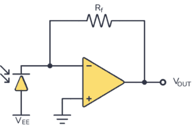
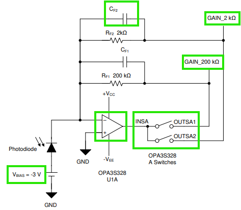
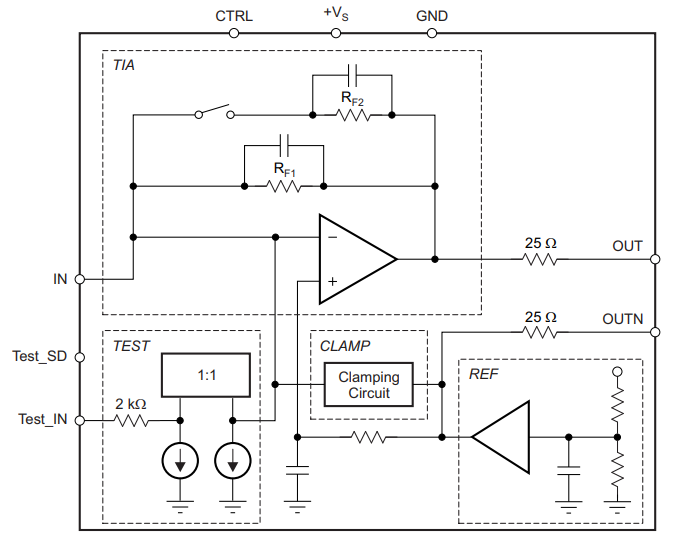

## 📈 Progress
This will be a technical summary of the work I completed in my notebook designing the circuitry for the signal modification of the fluorescent sensor. I thought in a rational manner, taking it step-by-step and asking myself as many questions as possbile along the way.

---

### Sensor Basics

Linearity: Linearity is how consistently a sensor's output changes in proportion to the input. A perfectly linear sensor would produce a perfectly straight-line graph when you plot its output versus the physical quantity it's measuring. With good linearity, you can use a few points as opposed to a complex curve-fitting formula to convert its output into a real-world value and more easily verify its accuracy. 

Sensitivity: Sensitivity is how much a sensor's output changes for a given change in the quantity it's measuring. A high-sensitivity sensor produces a large change in output for a small change in input. Higher sensitivity is usually desired so that the delta is maximized for observation into the effects of the target of the sensor.

Stability: is a sensor's ability to provide consistent and accurate readings over a long period. A sensor is stable if its characteristics do not change with time. If a sensor lacks stability, its performance will degrade over time. This is known as drift. Drift can occur due to several reasons, including the aging of the physical properties of a sensor's component, environmental stress, and contamination. 

Noise: Noise in an electrical system is unwanted, outside interference in the sensor's output signal. Noise can be a signal from the sensor's own electronics, external electrical interference, or heat. It obscures the real signal. In this field, we desire a high SNR, or signal-to-noise ratio. We desire a strong signal with little noise so our observation only includes what was intended to be measured.

Bandwidth: Bandwidth is the range of frequencies over which a sensor can accurately measure and respond to a changing input. A sensor with a high bandwidth can accurately capture rapid changes in a signal. We can establish this bandwidth with capacitors that allow a specific range of signals to pass through the resistor before acting as a short to ground.

Junction Capacitance: The parasitic junction capacitance is the unwanted capacitance that occurs at the p-n junction of a photodiode and other semiconductor devices. At high frequencies, it can slow down the sensor's response time.

---

### Converting Current to Voltage

First, we have the current generated by the photodiode. This current needs to be converted to a voltage for the microncontroller to process. To do this, we can use a transimpedance amplifier. The photodiode's current can be fed into the inverting input, and the current across the feedback resistor converts it to a voltage. In this case, our output voltage is equal to -Ip * R1. 

 

We want to maximize our sensitivity. We can do this by using a larger feedback resistor to create a larger gain for more voltage per unit of current. I could also implement a second stage of amplification, but that will not be neccessary considering the low signal values required for the microcontroller. Choosing an op-amp with a low-level bias current and voltage will also be helpful in dealing with the input/output bias conversion accuracy and leakage current of op-amp. We also want to maximize linearity. This is already taken care of by the characteristic op-amp, which has a virtual ground because of the essentially infinite resistance, and the photodiode will see almost no voltage across it. To avoid any sort of oscillation, we can add a small feedback capacitor across the resistor to damp the signal peaking and establish a bandwidth.

 

---

### Photodiode Bias
The speed and sensitivity of the photodiode are dependent on the parasitic junction capacitance. If there is a higher capacitance, we yield a slower response and worse bandwidth. A reverse bias can be abbplied to the photodiode to reduce this capacitance, meaning we apply a DC voltage across it in the opposite direction of the normal current flow. The reverse bias widens the insulating depletion region which decreases the capacitance. 

 

---

### Signal Variability
My largest concern is the possibility of signal saturation due to a strong enough light intensity. If we use a strong enough light source, the curent generated is greater than the ADC can handle, and we reach saturation thus leading to an incorrect measurement. The solution to this is to implement a programmable gain transimpedance amplfier. A resistor ladder is implemented with analog switches to allow us to adjust the feedback resistor according to the photodiode current.

 

The above model features the specifications we desire. A reverse bias is present to address the parasitic junction capacitance. A feedback capacior is present to establish the bandwidth for our sensing capability. There are two levels of gain that can be used via analog switches if the signal is extra-low or extra-high. The op-amp in the configuration produces a voltage proportional to the photocurrent. Other considerations to take into account include the stability of the device. In a more complex circuit, the common-mode and differential input capacitances from the op-amp would need to be specified. Factoring in all capacitances, this model offers 40 MHz bandwidth, which meets the requirements of a project like this. 

The TIA I have selected is the OPA857, described as "OPA857 Ultralow-Noise, Wideband, Selectable-Feedback Resistance
Transimpedance Amplifier." Per the official description, "The OPA857 is a wideband, fast overdrive recovery, fast-settling, ultralow-noise transimpedance amplifier targeted at photodiode monitoring applications. With selectable feedback resistance, the OPA857 simplifies the design of high-performance optical systems. Very fast overload recovery time and internal input protection provide the best combination to protect the remainder of the signal chain from overdrive while minimizing recovery time. The two selectable transimpedance gain configurations allow high dynamic range and flexibility required in modern transimpedance amplifier applications." 

 

---

### LED Modulation
Fluorescence signals are very weak and can be contaminated by ambient light and other background noise. At this point, we are measuring the DC signal alone. A potential solution is to module the LED at a specific frequency, such as 500 Hz to 2kHz, and multiplying the output of our transimpedance amplfier by a reference of the same frequency. Therefore, only signals at the modulation frequency would be amplified, leading to a rejection of the DC and outside noise for a huge SNR improvement. This is more so a solution to a problem that hasn't even arisen yet. I am simply thinking of contingencies if the device does not operate properly. For another solution, the individual using the sensor could simply be instructed to perform the action in a darker environment. For the purpose of this project, the TIA selected will most likely perform sufficiently. 

## 🧩 Challenges
Today's challenge was continuing to explore the electronics characteristics of photodiodes and TIA's to select the most optimal components for this project. The deeper you go into circuit theory, the more complicated it becomes. All the specific solutions are provided in the individual sections above.

## 🥅 Goals
Tomorrow, I would like to flesh out the physical design of the device. I plan to begin with a system-level block diagram and build my way up towards a technical sketch, and ultimately a schematic to be implemented as a PCB. I plan to consider all aspects in this project, including product design, scalability, and marketability for this theoretical product that could be commercialized in the future.
