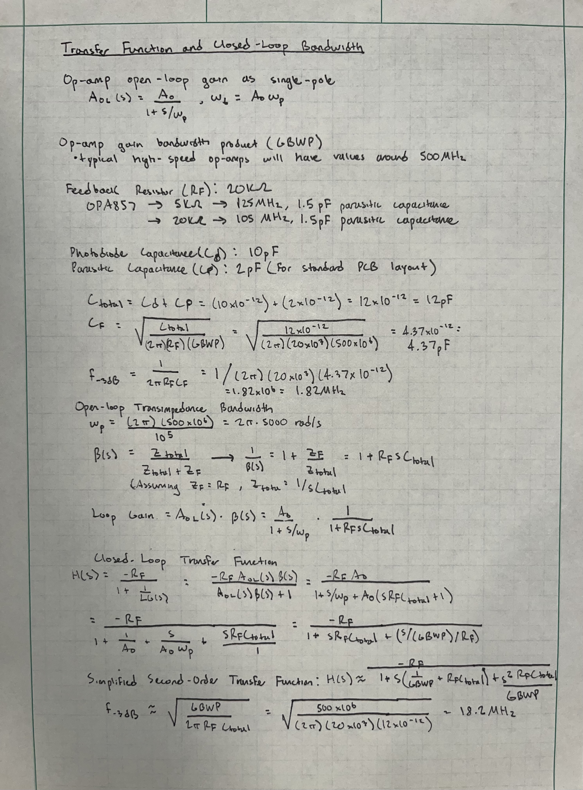

## 📈 Progress

Today, I was able to calculate our theoretical f-3dB value. It is important to recognize that the significant disparity between the -3 dB frequency calculations (1.82 MHz versus 18.2 MHz) is due to moving from an oversimplified first-order analysis to a more accurate second-order model that incorporates the non-ideal characteristics of an active device (its finite gain-bandwidth product (GBWP)). 

While the 1/(2piRC) formula treats the external components as the sole determinant of the cutoff frequency, assuming an ideal amplifier with infinite bandwidth, the second-order model accounts for the interaction between the pole created by the external RC network and the internal dominant pole of the op-amp. Negative feedback fundamentally alters the pole locations which can cause them to form a conjugate pair, which transforms the system's frequency response from a simple, predictable first-order roll-off to a more complex second-order response. This interaction can introduce a damping factor (Q) that, if underdamped (Q>0.707), results in a resonant peak near the new pole frequencies. This essentially shifts the -3 dB point to a significantly higher frequency than the passive RC value alone. 

The closed-loop transfer function, derived by including the op-amp's frequency-dependent open-loop gain and its GBWP, correctly predicts this behavior. The dominant pole approximation, which is only valid when the external RC pole is much lower than the op-amp's internal pole, fails to capture this resonant interaction. Therefore, the calculation incorporating GBWP provides a far more accurate representation of the active filter's actual bandwidth limitations.

 

## 🧩 Challenges

I've always enjoyed the challenge of deriving/sovling a mathematical equation, which is exactly was transpired today. After some time, I was able to successfully calculate the theoretical bandwdith for our system.

## 🥅 Goals

Tomorrow, I plan to complete all noise calculations, an integral part of any sensing system.
