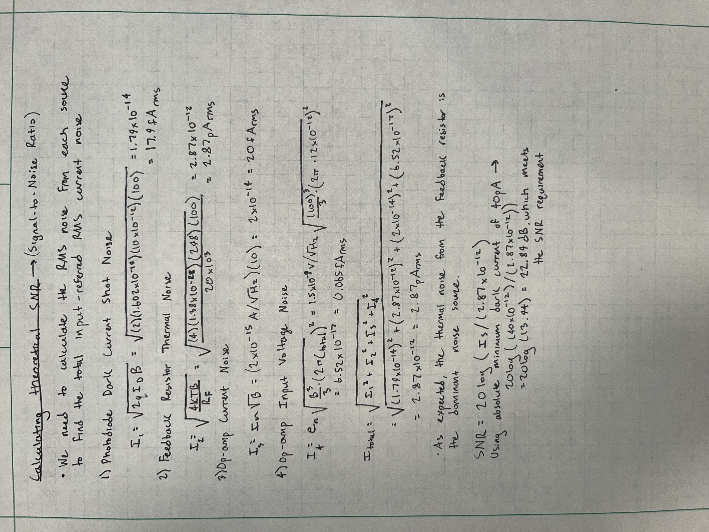

## 📈 Progress

Today, I was able to calculate the thoeretical SNR. The final value came out around 23dB, which meets the outlined specifications for the project.

 

## 🧩 Challenges

The challenges today were ensuring I included all noise sources into the final RSS calculation as well as completing the calculations correctly. SNR is one of the most important aspects in any electronic sensing system, where a higher SNR means we yeild a clearer, more reliable signal. This is especially critical in light-based systems where you want to mitigate the noise from outside light sources.

## 🥅 Goals

Tomorrow, I plan to explore common analog-front end architectures to ultimately build a custom design that could, in theory, replace the OPA857.
