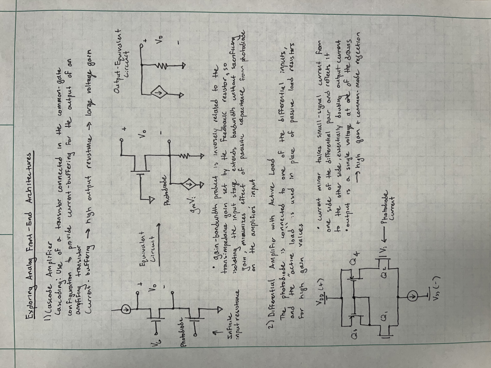

## 📈 Progress

Today, I explored common analog front-end architectures with different performance characteristics and tradeoffs.

 

## 🧩 Challenges

The final product doesn't need to be an ultra-efficient high performance technology masterpiece, but it should still have optimized sensitivity, stability, and SNR. Therefore, the challenge lies in looking at the bigger picture, incorporating these designs, and putting all of the components and calculations together to build a cohesive system.

## 🥅 Goals

Tomorrow, I plan to flesh out the full analog design for all of the individual circuits within the device including the final TIA topology, a way to visualize the performance of the system through an LED, and the power regulation.
