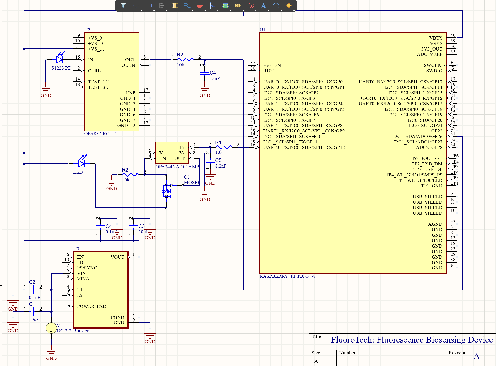

## 📈 Progress

Today, I designed the preliminary schematic using Altium Designer.

 

## 🧩 Challenges

I was familiar with KiCad, so getting up to speed with Altium presented a unique challenge. 

## 🥅 Goals

Next week, I plan to implement my design in LTspice and compare the theoretical results with experimental data from the manufacturer. I would also like to complete a preliminary PCB design (before my one-month free trial runs out).
