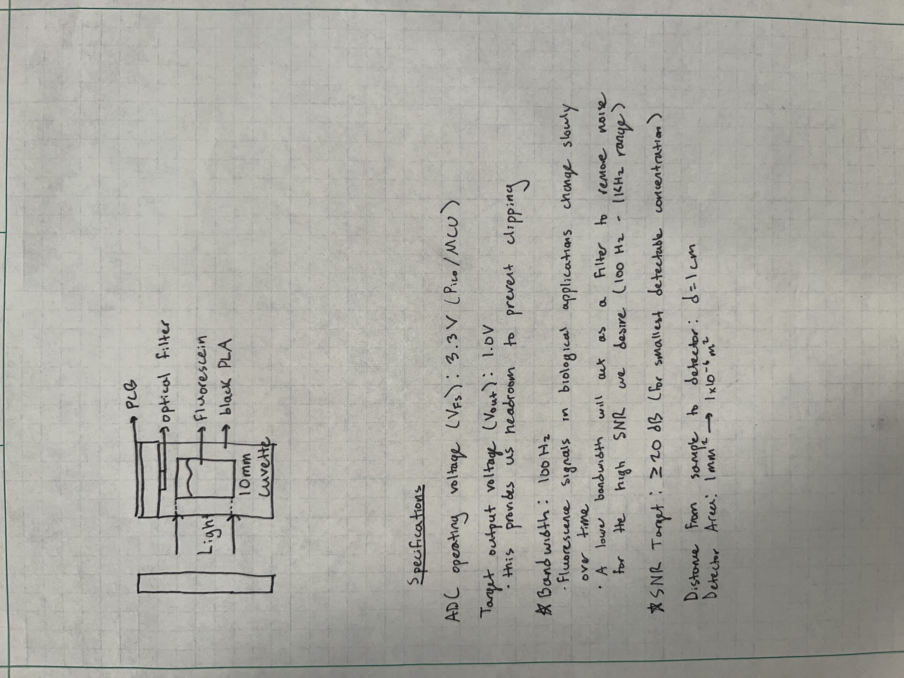

## 📈 Progress

Today, I made a simple sketch of how I envision the device to help me understand its structure and layout. I also listed general circuit specifications. From this point on, much of the work will be completed by hand because I feel I am able to absorb the information better (and because it's enjoyable to write out your thoughts with a nice pen on graph paper).

 

## 🧩 Challenges

Selecting the correct specs required reserach in fluorescent sensing systems. The bandwidth and SNR had to be researched for the optimization of the light detection.

## 🥅 Goals

Tomorrow, I plan to calculate the expected photocurrent and draw out the photodiode + TIA topology.
