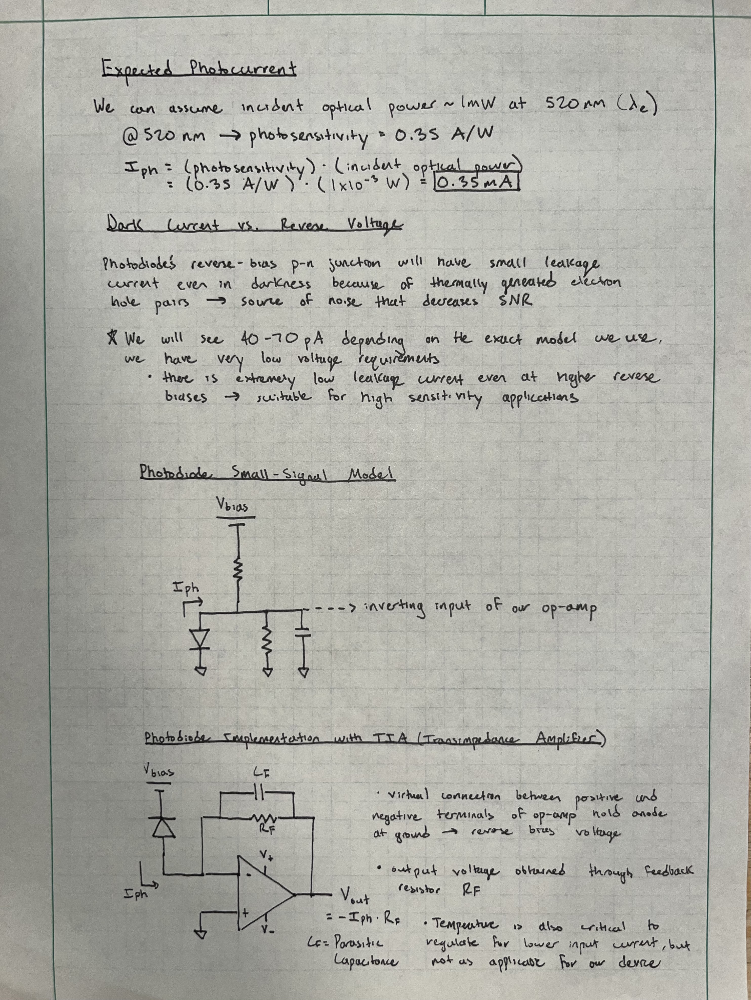

## 📈 Progress

Today, I was able to calculate the expected photocurrent using the spectral response and dark current vs. reverse voltage graphs from the photodiode datasheet. i also drew out the small-signal model and explored the standard photodiode implementation with a TIA.

 

## 🧩 Challenges

It was both challenging and rewarding to read up on the low-level physics of the dark current vs. reverse voltage phenomenon in a photodiode. 

## 🥅 Goals

Tomorrow, I plan to derive the transfer function and closed-loop bandwidth of the system. 
